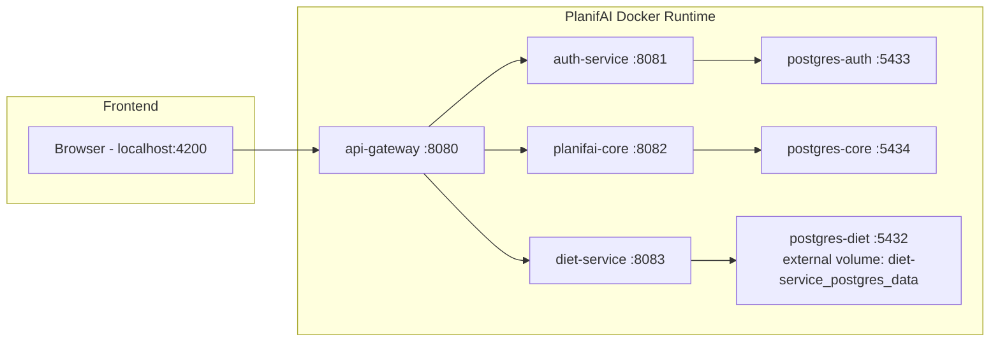

# PlanifAI Technical Closure - Wave 1.5

Fecha de cierre: 2026-05-17  
Branch principal de trabajo: `config/wave1.5`

## 1. Resumen Ejecutivo

Wave 1.5 cierra la limpieza arquitectonica de PlanifAI y deja el proyecto en un estado tecnicamente mas honesto, mantenible y alineado con su realidad de producto.

PlanifAI deja de funcionar como un laboratorio activo de microservicios Spring Cloud y pasa a ser una aplicacion modular con una separacion mas pragmatica:

- `api-gateway` como entrada unica para el frontend.
- `auth-service` como servicio separado para mantener el aprendizaje y la logica JWT.
- `planifai-core` como backend modular para tareas y finanzas.
- `diet-service` como bounded context separado y funcional, conservando su base de datos poblada.
- `frontend Angular` consumiendo siempre a traves del gateway.
- `Docker Compose` como orquestador local.

Spring Cloud Config Server y Eureka quedan fuera del runtime activo. Se conservan como artefactos de laboratorio en `lab/spring-cloud`.

## 2. Objetivo de Wave 1.5

El objetivo principal fue dejar de hacer "enterprise cosplay architecture" y convertir PlanifAI en una arquitectura limpia para un proyecto personal real.

Objetivos concretos:

- Reducir infraestructura innecesaria.
- Eliminar servicios legacy/placeholders.
- Integrar el `diet-service` real.
- Mantener datos existentes de diet.
- Mantener gateway como punto unico de entrada.
- Mantener auth separado por valor de aprendizaje.
- Crear una base razonable para `tasks` y `finance` sin convertirlos en microservicios prematuros.
- Validar que el frontend puede consumir diet, tasks y finance a traves del gateway.

## 3. Repositorios Activos

### PlanifAI

Repositorio orquestador e infraestructura activa.

Contiene:

- `gateway/api-gateway`
- `auth/auth-service`
- `core/planifai-core`
- `docker-compose.yml`
- `docker-compose.dev.yml`
- `docker-compose.full.yml`
- documentacion tecnica
- laboratorio Spring Cloud preservado

### diet-service

Servicio real de Diet MVP entregado en Wave 1.

Contiene:

- dominio de dietas, recetas, alimentos, inventario y compra
- arquitectura hexagonal
- contrato OpenAPI
- DTOs generados
- MapStruct
- persistencia PostgreSQL
- datos reales/poblados en volumen Docker existente

### planifai-front

Frontend Angular funcional.

Contiene:

- pantallas de diet
- inventario
- compra
- nuevas pantallas MVP de tasks y finance
- consumo HTTP via gateway

### PlanifAI-config-repo

Repo de configuracion preservado de la etapa Spring Cloud.

No forma parte del runtime activo de Wave 1.5.

## 4. Arquitectura Actual



## 5. Servicios Activos

### api-gateway

Responsabilidad:

- entrada HTTP unica para el frontend
- routing explicito a servicios internos
- centralizacion de CORS
- deduplicacion de headers CORS cuando un backend tambien responde CORS
- base para futuras politicas de seguridad perimetral

Puerto:

- `8080`

Rutas principales:

- `/api/auth/**` -> `auth-service:8081`
- `/api/tasks/**` -> `planifai-core:8082`
- `/api/finance/**` -> `planifai-core:8082`
- `/api/v1/diets/**` -> `diet-service:8083`
- `/api/v1/foods/**` -> `diet-service:8083`
- `/api/v1/recipes/**` -> `diet-service:8083`
- `/api/v1/inventory/**` -> `diet-service:8083`
- `/api/v1/shopping-lists/**` -> `diet-service:8083`
- `/api/v1/meal-slots/**` -> `diet-service:8083`

CORS:

- origen permitido: `http://localhost:4200`
- metodos: `GET`, `POST`, `PUT`, `PATCH`, `DELETE`, `OPTIONS`
- headers permitidos: `*`
- credentials habilitado
- filtro `DedupeResponseHeader` para evitar errores por headers duplicados entre gateway y backends

### auth-service

Responsabilidad:

- autenticacion
- JWT
- persistencia de usuarios/auth

Puerto:

- `8081`

Base de datos:

- `postgres-auth`
- host local expuesto: `localhost:5433`
- database: `authdb`

Estado:

- se mantiene separado por valor de aprendizaje y porque representa una preocupacion transversal real.

### planifai-core

Responsabilidad:

- backend modular para funcionalidades que no justifican un microservicio propio todavia
- contiene actualmente:
  - `tasks`
  - `finance`

Puerto:

- `8082`

Base de datos:

- `postgres-core`
- host local expuesto: `localhost:5434`
- database: `coredb`

Arquitectura:

- hexagonal por modulo funcional
- contract-first via OpenAPI
- DTOs generados con OpenAPI Generator
- MapStruct para mapeo
- JPA adapters
- use cases en capa application
- dominio separado de infraestructura

### diet-service

Responsabilidad:

- dietas
- recetas
- alimentos
- inventario
- lista de compra
- meal slots

Puerto:

- `8083`

Base de datos:

- `postgres-diet`
- host local expuesto: `localhost:5432`
- database: `diet_db`
- user: `postgres`
- password: `1234`
- volumen reutilizado: `diet-service_postgres_data`

Estado:

- se mantiene como servicio separado porque ya es el bounded context mas maduro y realista del proyecto.
- no se reintroduce el legacy `PlanifAI/diet/diet-service`.
- el compose global reutiliza el volumen poblado original del repo `diet-service`.

### frontend

Responsabilidad:

- UI Angular
- consumo de APIs a traves del gateway

Puerto:

- `4200`

Rutas actuales:

- `/diet/calendar`
- `/diet/create`
- `/diet/recipes`
- `/inventory`
- `/shopping`
- `/tasks`
- `/finance`

## 6. Modulos y Features

### Diet

Estado:

- funcional
- datos reales preservados
- integrado via gateway

Features activas:

- recetas
- alimentos
- calendario/dietas
- inventario
- lista de compra
- meal slots

Endpoints principales:

- `GET /api/v1/foods`
- `GET /api/v1/recipes`
- `GET /api/v1/inventory`
- `POST /api/v1/inventory`
- `GET /api/v1/shopping-lists/current`
- `GET/POST/PUT/DELETE` segun contrato del servicio de diet

### Tasks

Estado:

- MVP tecnico para validar gateway + core + frontend
- persistencia real en `postgres-core`

Modelo inicial:

- `id`
- `title`
- `description`
- `status`: `TODO`, `IN_PROGRESS`, `DONE`
- `priority`: `LOW`, `MEDIUM`, `HIGH`
- `dueDate`
- `createdAt`

Endpoints:

- `GET /api/tasks`
- `POST /api/tasks`

Frontend:

- ruta `/tasks`
- formulario simple de creacion
- lista de tareas

Decisiones:

- no se implementa aun kanban completo
- no se implementan subtareas, etiquetas, ordenacion avanzada ni ownership
- el modelo es suficiente para validar el modulo y evolucionarlo en Wave 2

### Finance

Estado:

- MVP tecnico para validar gateway + core + frontend
- persistencia real en `postgres-core`
- tablas inicialmente vacias

Modelo inicial de gastos:

- `id`
- `concept`
- `amount`
- `expenseDate`
- `category`
- `recurrence`
- `notes`

Categorias de gastos:

- `MORTGAGE`
- `RENTAL_PROPERTY`
- `UTILITIES`
- `GROCERIES`
- `TRANSPORT`
- `HEALTH`
- `LEISURE`
- `TAXES`
- `OTHER`

Modelo inicial de ingresos:

- `id`
- `source`
- `amount`
- `incomeDate`
- `category`
- `recurrence`
- `notes`

Categorias de ingresos:

- `SALARY`
- `RENTAL_INCOME`
- `FREELANCE`
- `INVESTMENT`
- `OTHER`

Recurrencia:

- `ONE_OFF`
- `MONTHLY`
- `YEARLY`

Endpoints:

- `GET /api/finance/expenses`
- `POST /api/finance/expenses`
- `GET /api/finance/incomes`
- `POST /api/finance/incomes`

Frontend:

- ruta `/finance`
- tabla de gastos
- tabla de ingresos
- lectura via gateway

Decisiones:

- no se implementan aun formularios de alta en frontend para finance
- no se implementan budgets, cuentas bancarias, hipoteca detallada, cashflow ni reporting
- el modelo queda preparado para evolucionar desde la economia familiar real del proyecto

## 7. Arquitectura Interna de planifai-core

Patron por modulo:

```text
module/
  domain/
    model/
  application/
    ports/
      input/
      output/
    usecase/
  infrastructure/
    input/
      rest/
        mapper/
    output/
      jpa/
        entity/
        mapper/
        repository/
```

Principios:

- el dominio no depende de Spring
- los use cases implementan puertos de entrada
- los adapters JPA implementan puertos de salida
- REST implementa interfaces generadas por OpenAPI
- los DTOs no entran en dominio
- MapStruct separa DTO/domain/entity

Contratos:

- `core/planifai-core/src/main/resources/openapi/core-openapi.yml`

Generacion:

- OpenAPI Generator Maven Plugin
- paquetes generados:
  - `com.planifai.core.api`
  - `com.planifai.core.dto`

## 8. Infraestructura Docker

### Compose base

Archivo:

- `docker-compose.yml`

Servicios base:

- `api-gateway`
- `auth-service`
- `planifai-core`
- `postgres-auth`
- `postgres-core`

### Compose dev

Archivo:

- `docker-compose.dev.yml`

Responsabilidad:

- exponer puertos locales
- inyectar variables de entorno dev
- modo hibrido con diet externo en IntelliJ si se desea

### Compose full

Archivo:

- `docker-compose.full.yml`

Servicios adicionales:

- `frontend`
- `diet-service`
- `postgres-diet`

Punto importante:

- `postgres-diet` reutiliza el volumen externo `diet-service_postgres_data`
- este volumen contiene la base de datos poblada original de `diet-service`
- no debe borrarse salvo que se quiera perder los datos de diet

Comando recomendado full stack:

```powershell
cd C:\PlanifAI-Project\PlanifAI
docker compose -f docker-compose.yml -f docker-compose.dev.yml -f docker-compose.full.yml up --build
```

## 9. Persistencia y Volumenes

### Auth

- service: `postgres-auth`
- database: `authdb`
- port local: `5433`
- volume: `planifai_postgres_auth_data`

### Core

- service: `postgres-core`
- database: `coredb`
- port local: `5434`
- volume: `planifai_postgres_core_data`

### Diet

- service: `postgres-diet`
- database: `diet_db`
- port local: `5432`
- external volume: `diet-service_postgres_data`

Nota operacional:

- no levantar simultaneamente el `diet-postgres` standalone del repo `diet-service` y el `postgres-diet` del compose global usando el mismo volumen.
- solo un contenedor Postgres debe montar `diet-service_postgres_data` a la vez.

## 10. Herramientas, Plugins y Dependencias Tecnicas

### Backend

- Java 17
- Spring Boot
- Spring Web
- Spring Data JPA
- Spring Validation
- Spring Actuator
- Spring Cloud Gateway
- PostgreSQL Driver
- OpenAPI Generator Maven Plugin
- Swagger annotations para codigo generado
- Jackson Databind Nullable para compatibilidad del generator
- MapStruct
- Maven

### Frontend

- Angular
- Angular Router
- Angular HttpClient
- Reactive Forms
- Signals
- Nginx para imagen Docker de frontend
- Node Alpine para build Docker

### Orquestacion

- Docker Compose
- healthchecks en gateway/core
- volumenes Docker persistentes
- `host.docker.internal` preservado para modo hibrido

### Laboratorio preservado

- Spring Cloud Config Server
- Eureka Server

Ubicacion:

- `lab/spring-cloud`

Estado:

- fuera del runtime activo
- conservado para aprendizaje y referencia

## 11. Decisiones Arquitectonicas Cerradas

### Se elimina Eureka del runtime activo

Motivo:

- los servicios son conocidos
- no hay replicas dinamicas
- no hay elasticidad real
- aumenta el coste cognitivo sin beneficio actual

### Se elimina Config Server del runtime activo

Motivo:

- configuracion local resuelta por env vars, Spring profiles y Compose
- GitHub config repo metia dependencia de auth innecesaria
- no hay necesidad real de config centralizada en esta fase

### Se mantiene API Gateway

Motivo:

- punto unico para frontend
- permite integrar `diet-service` separado sin que Angular conozca topologia interna
- centraliza CORS
- abre camino a auth perimetral futura

### Se mantiene auth-service separado

Motivo:

- valor de aprendizaje en JWT/auth
- preocupacion transversal real
- separacion razonable incluso en una arquitectura simplificada

### Tasks y Finance no son microservicios

Motivo:

- no justifican despliegue independiente
- dominios aun inmaduros
- aumentarian coste de operacion y coordinacion
- encajan mejor como modulos dentro de `planifai-core`

### Diet se mantiene separado

Motivo:

- es el bounded context mas maduro
- ya tiene arquitectura hexagonal real
- ya tiene datos y funcionalidad
- puede evolucionar independientemente si el producto crece

## 12. Seguridad y CORS

Estado actual:

- auth-service mantiene logica JWT
- gateway aun no aplica enforcement JWT global
- CORS centralizado en gateway para `http://localhost:4200`
- gateway deduplica headers CORS para evitar conflicto con backends que tambien los emiten

Configuracion relevante:

- `spring.cloud.gateway.globalcors`
- `DedupeResponseHeader`

No implementado aun:

- autorizacion por ruta en gateway
- scopes/roles
- refresh tokens robustos
- gestion avanzada de secretos
- hardening productivo

## 13. Validaciones Realizadas

### Build backend

```powershell
mvn package "-Dmaven.test.skip=true"
```

Resultado:

- OK

Nota:

- los tests completos no se consideran criterio de cierre en esta wave porque ya se habia decidido no bloquear Wave 1.5 por tests existentes.

### Build frontend

```powershell
npm.cmd run build -- --configuration production
```

Resultado:

- OK

### Compose config

```powershell
docker compose -f docker-compose.yml -f docker-compose.dev.yml config
docker compose -f docker-compose.yml -f docker-compose.dev.yml -f docker-compose.full.yml config
```

Resultado:

- OK

### Runtime

Endpoints validados:

- `GET http://localhost:8080/actuator/health`
- `GET http://localhost:8081/actuator/health`
- `GET http://localhost:8082/actuator/health`
- `GET http://localhost:8080/api/tasks`
- `POST http://localhost:8080/api/tasks`
- `GET http://localhost:8080/api/finance/expenses`
- `GET http://localhost:8080/api/finance/incomes`
- `GET http://localhost:8080/api/v1/foods`
- `GET http://localhost:8080/api/v1/recipes`
- `GET http://localhost:8080/api/v1/inventory`
- `GET http://localhost:4200/tasks`
- `GET http://localhost:4200/finance`

Resultado:

- OK

CORS validado:

- preflight `OPTIONS /api/tasks`
- preflight `OPTIONS /api/v1/recipes`
- requests desde `Origin: http://localhost:4200`

Resultado:

- OK

## 14. Estado Funcional Actual

### Funciona

- frontend servido en `localhost:4200`
- gateway servido en `localhost:8080`
- auth-service levantado
- planifai-core levantado
- diet-service levantado
- base de datos diet poblada preservada
- inventario diet visible via gateway
- recetas/foods disponibles via gateway
- tasks visible en frontend
- creacion de task desde frontend via gateway
- finance visible en frontend con tablas vacias
- CORS corregido para core y diet

### Parcial

- finance tiene backend de lectura/escritura basico, pero frontend solo lectura
- tasks tiene crear/listar, pero no editar/borrar/kanban
- auth existe, pero gateway aun no aplica una politica global de autorizacion

### No incluido en Wave 1.5

- Kubernetes
- CI/CD
- observabilidad avanzada
- service discovery activo
- centralized config activo
- microservicios task/finance
- hardening productivo
- secretos gestionados por Vault/Cloud
- frontend completo para finanzas
- kanban completo

## 15. Riesgos y Deuda Tecnica Conocida

### Tests

Hay tests previos que no pasan en `mvn install` completo. Para Wave 1.5 se ha validado con:

- compile/package saltando tests
- endpoints reales
- compose
- runtime manual

Deuda:

- revisar y estabilizar tests en una wave especifica.

### Seguridad

El gateway aun no es un enforcement point completo de JWT.

Deuda:

- decidir si auth se aplica en gateway, en servicios, o mixto.

### Finance

Modelo inicial correcto para MVP, pero incompleto para una app real de finanzas familiares.

Evolucion probable:

- cuentas
- propiedades
- hipoteca
- ingresos recurrentes
- gastos recurrentes
- cashflow mensual
- categorias configurables
- presupuestos
- reporting

### Tasks

Modelo inicial suficiente para MVP.

Evolucion probable:

- estados kanban
- subtareas
- etiquetas
- fecha de inicio
- recurrencia
- ordenacion
- filtros
- archivado

### Docker volumes

El volumen de diet es externo y valioso.

Riesgo:

- borrar `diet-service_postgres_data` elimina los datos poblados de diet.

## 16. Estructura de Runtime Recomendada

Para trabajar en todo el producto:

```powershell
cd C:\PlanifAI-Project\PlanifAI
docker compose -f docker-compose.yml -f docker-compose.dev.yml -f docker-compose.full.yml up --build
```

Para modo hibrido con `diet-service` desde IntelliJ:

```powershell
cd C:\PlanifAI-Project\PlanifAI
docker compose -f docker-compose.yml -f docker-compose.dev.yml up --build api-gateway postgres-auth auth-service postgres-core planifai-core
```

En modo hibrido, `diet-service` puede ejecutarse aparte en `localhost:8083`.

## 17. Criterio de Cierre de Wave 1.5

Wave 1.5 se considera cerrada porque:

- la arquitectura activa esta simplificada
- Config Server y Eureka estan fuera del runtime activo
- gateway se mantiene y funciona
- auth-service se mantiene
- planifai-core existe como backend modular para tasks/finance
- diet-service real esta integrado
- datos poblados de diet se conservan
- frontend consume diet, tasks y finance via gateway
- Docker Compose levanta la app completa
- CORS esta resuelto en gateway
- el estado tecnico queda documentado

## 18. Siguiente Wave Recomendada

Prioridad recomendada para la siguiente etapa:

1. Consolidar tests basicos de runtime.
2. Mejorar UI/UX de tasks.
3. Empezar finance real con formularios y datos personales/familiares.
4. Revisar estrategia de auth/JWT en gateway.
5. Definir migraciones de BD con Flyway o Liquibase para `planifai-core`.
6. Crear smoke tests automatizados para gateway -> servicios.

La siguiente wave deberia centrarse en producto y mantenibilidad, no en aumentar infraestructura.

